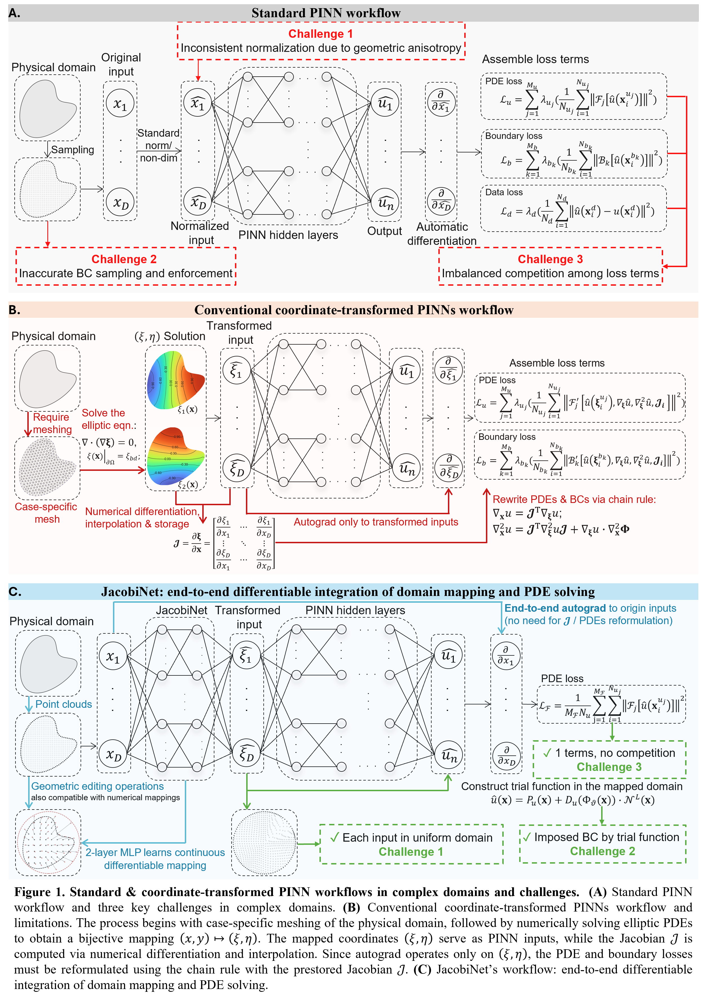
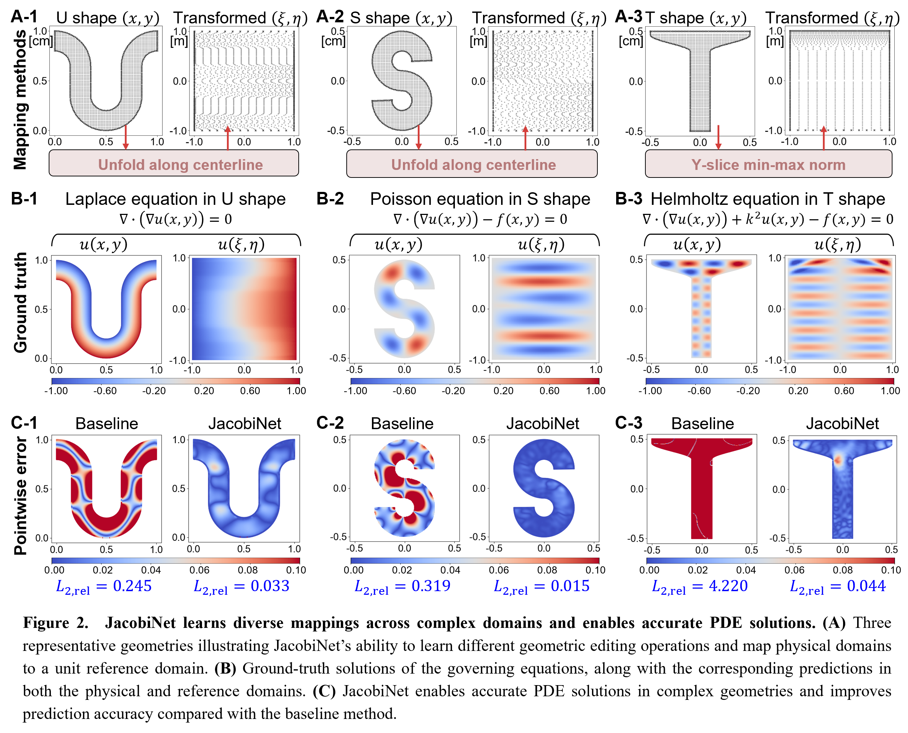
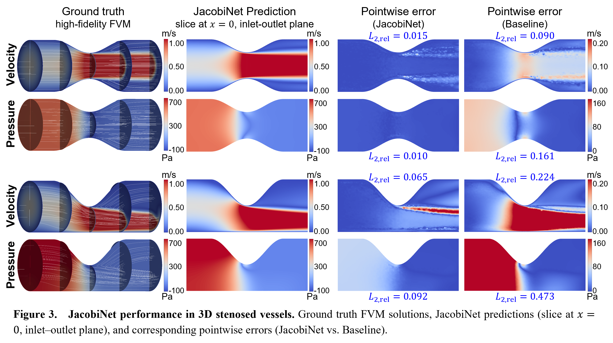

# Solved in Unit Domain: JacobiNet for Differentiable Coordinate-Transformed PINNs

Accepted by *Journal of Computational Physics*. DOI, final publication link, and BibTeX citation will be updated after publication.

## Method Overview

Physics-Informed Neural Networks (PINNs) can become unstable in irregular domains because geometric anisotropy affects normalization, boundary conditions are harder to enforce, and different loss terms compete during optimization. Conventional coordinate-transformed PINNs map the domain to a regular reference space, but typically rely on case-specific meshes, precomputed Jacobians, and manual chain-rule reformulation.



JacobiNet learns a differentiable coordinate mapping and shares the computation graph with the downstream PINN solver. In the 2D U-shaped, S-shaped, and T-shaped benchmarks, this separates physical modeling from geometric complexity and enables PINN solving in a regularized domain.



The same differentiable coordinate-transform workflow is applied to 3D concentric and eccentric stenosed-vessel domains, where JacobiNet supports Navier-Stokes PINN prediction in vessel-like geometries.



## Repository Layout

- `assets/`: README figures prepared from the accepted manuscript.
- `run_pinn.py`: root controller for batch PINN `train` and `eval` runs.
- `run_jacobinet.py`: standalone JacobiNet coordinate-transform training entrypoint.
- `configs.py`: shared configuration for PINN runs, JacobiNet geometry training, and layout checks.
- `codex/verify_layout.py`: release layout validation script.
- `pinn code_<CASE>/groundtruth_<CASE>/`: released reference data used for training and evaluation.
- `pinn code_<CASE>/pinn_baseline/`: baseline PINN implementation.
- `pinn code_<CASE>/pinn_jacobinet/`: JacobiNet implementation.
- `pinn code_<CASE>/parameter/`: released checkpoints.

Each `parameter` directory is expected to contain only:

- `jacobinet.pth`
- `pinn_baseline.pth`
- `pinn_jacobinet.pth`

## Cases

The controlled cases are:

- `U`
- `S`
- `T`
- `STENOSIS_CO`
- `STENOSIS_EC`

`ALL` runs every active controlled case.

## Setup

Create an environment with Python 3.10 or newer, then install the required packages:

```bash
pip install -r requirements.txt
```

The scripts were developed for CUDA-enabled PyTorch. They still default to the device settings in each case configuration.

## Running Experiments

Use the root controller from this directory:

```bash
python run_pinn.py --mode eval --cases ALL --methods all
python run_pinn.py --mode train --cases ALL --methods all
python run_pinn.py --mode eval --cases U,S,T --methods jacobinet
python run_pinn.py --dry-run --mode eval --cases ALL --methods all
```

`run_pinn.py` launches the original case scripts with `subprocess.run(..., cwd=method_dir)`, streams each case's normal stdout/stderr to the terminal, and also writes logs under `runs/<timestamp>/`.

For VSCode F5 usage, edit the switch block at the top of `run_pinn.py`:

```python
F5_CASES = ("U", "S", "T")
F5_METHODS = ("all",)
F5_MODE = "eval"
F5_PYTHON = None
```

`F5_PYTHON = None` uses the current Python interpreter. Set it to a Python executable path only for local convenience.

To retrain the standalone JacobiNet coordinate-transform checkpoints without overwriting the released `parameter/jacobinet.pth` files:

```bash
python run_jacobinet.py --cases ALL
python run_jacobinet.py --dry-run --cases U,S,T
```

For VSCode F5 usage, edit `F5_CASES` at the top of `run_jacobinet.py`.

## Data and Checkpoints

The `groundtruth_*` directories contain the released reference datasets used by the controlled scripts. Evaluation metrics are computed from model predictions and these reference datasets at runtime; metrics are not hard-coded in the source.

Some 3D CSV datasets are split into chunk directories to keep each repository file below GitHub's 100 MB limit:

- `groundtruth_STENOSIS_3D_CO/internal.csv.parts/`
- `groundtruth_STENOSIS_3D_CO/export_stenosis.csv.parts/`
- `groundtruth_STENOSIS_3D_EC/internal.csv.parts/`
- `groundtruth_STENOSIS_3D_EC/export_stenosis.csv.parts/`

The code still refers to the logical CSV names, such as `internal.csv` and `export_stenosis.csv`. The data loaders first read the single CSV if it exists; otherwise they automatically concatenate the sorted chunks from the corresponding `*.csv.parts/` directory. Users do not need to manually merge the chunks before running training or evaluation.

For JacobiNet runs, the geometric coordinate-transform network is not trained by the default `main.py` workflow. The scripts load the released `parameter/jacobinet.pth` checkpoint and train or evaluate the solution network according to the selected mode.

## Verification

Before submitting changes, run:

```bash
python codex/verify_layout.py
python run_pinn.py --dry-run --mode eval --cases ALL --methods all
python run_pinn.py --dry-run --mode train --cases ALL --methods all
python -m compileall -q .
```

Generated logs and Python caches are ignored by Git.
